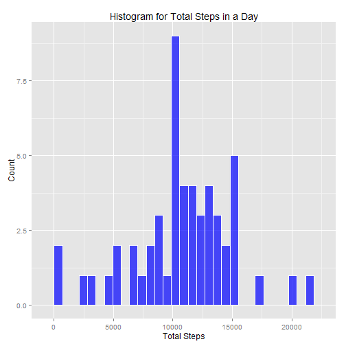
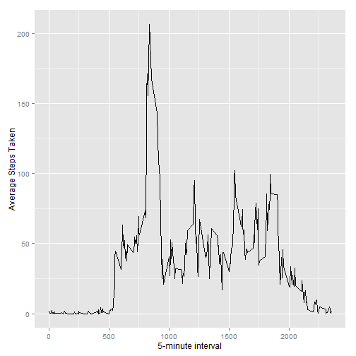
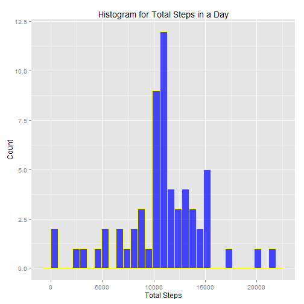
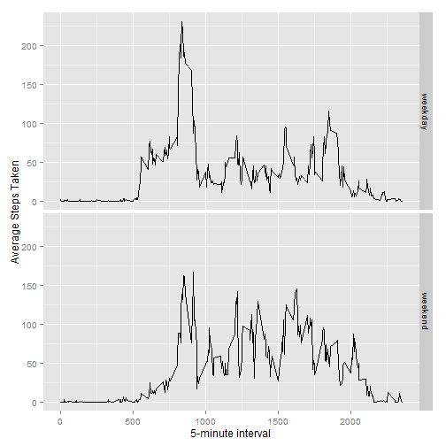

# Reproducible Research: Peer Assessment 1
##Introduction

It is now possible to collect a large amount of data about personal movement using activity monitoring devices such as a Fitbit, Nike Fuelband, or Jawbone Up. These type of devices are part of the “quantified self” movement – a group of enthusiasts who take measurements about themselves regularly to improve their health, to find patterns in their behavior, or because they are tech geeks. But these data remain under-utilized both because the raw data are hard to obtain and there is a lack of statistical methods and software for processing and interpreting the data.

This assignment makes use of data from a personal activity monitoring device. This device collects data at 5 minute intervals through out the day. The data consists of two months of data from an anonymous individual collected during the months of October and November, 2012 and include the number of steps taken in 5 minute intervals each day.

##Data

The data for this assignment can be downloaded from the course web site:

    Dataset: [Activity monitoring data](https://d396qusza40orc.cloudfront.net/repdata%2Fdata%2Factivity.zip)

The variables included in this dataset are:

    *steps:* Number of steps taking in a 5-minute interval (missing values are coded as NA)

    *date:* The date on which the measurement was taken in YYYY-MM-DD format

    *interval:* Identifier for the 5-minute interval in which measurement was taken

The dataset is stored in a comma-separated-value (CSV) file and there are a total of 17,568 observations in this dataset.

### Configure environment:

```
## Installing package into 'E:/Data/GoogleDrive/.checkpoint/2015-09-20/lib/x86_64-w64-mingw32/3.2.1'
## (as 'lib' is unspecified)
```

```
## package 'checkpoint' successfully unpacked and MD5 sums checked
## 
## The downloaded binary packages are in
## 	C:\Users\David\AppData\Local\Temp\Rtmpa8FSL5\downloaded_packages
```

```
## 
## checkpoint: Part of the Reproducible R Toolkit from Revolution Analytics
## http://projects.revolutionanalytics.com/rrt/
## Scanning for packages used in this project
```

```
## 
  |                                                                       
  |                                                                 |   0%
  |                                                                       
  |=================================================================| 100%
```

```
## - Discovered 7 packages
## All detected packages already installed
## checkpoint process complete
## ---
```

```
## Warning: package 'dplyr' was built under R version 3.2.2
```

```
## 
## Attaching package: 'dplyr'
## 
## The following objects are masked from 'package:stats':
## 
##     filter, lag
## 
## The following objects are masked from 'package:base':
## 
##     intersect, setdiff, setequal, union
```

```
## Warning: package 'ggplot2' was built under R version 3.2.2
```

```
## Warning: package 'ggvis' was built under R version 3.2.2
```

```
## 
## Attaching package: 'ggvis'
## 
## The following object is masked from 'package:ggplot2':
## 
##     resolution
```

```
## Warning: package 'gridExtra' was built under R version 3.2.2
```

```
## Warning: package 'lubridate' was built under R version 3.2.2
```

### Download & extract data from course website


```r
download.file("https://d396qusza40orc.cloudfront.net/repdata%2Fdata%2Factivity.zip","ActivityMonitoringData.zip")
activity <- read.csv(unz("ActivityMonitoringData.zip", "activity.csv"))
activity <- tbl_df(data.frame(activity))
activity <- activity %>%
    mutate(date = ymd(date))
```
[//]: ============================================================================================
## What is mean total number of steps taken per day?

[//]: For this part of the assignment, you can ignore the missing values in the dataset.

###   Calculate the total number of steps taken per day

```r
stepsByDate <- activity %>%
    group_by(date)  %>%
    summarise(totalSteps = sum(steps), meanSteps = mean(steps))
```

###   Make a histogram of the total number of steps taken each day

```r
ggplot(data=stepsByDate, aes(stepsByDate$totalSteps)) + 
    geom_histogram(col="white", 
                fill="blue",
                alpha = .7) +
                labs(title="Histogram for Total Steps in a Day") +
                labs(x="Total Steps", y="Count")
```

```
## stat_bin: binwidth defaulted to range/30. Use 'binwidth = x' to adjust this.
```

 

```r
# dev.off()
```

### Calculate and report the mean and median of the total number of steps taken per day

```r
stepsByDate %>%
    filter(!is.na(totalSteps)) %>%
    summarise(meanTotalSteps = mean(totalSteps), medianTotalSteps = median(totalSteps))
```

```
## Source: local data frame [1 x 2]
## 
##   meanTotalSteps medianTotalSteps
##            (dbl)            (int)
## 1       10766.19            10765
```
[//]: ============================================================================================
##What is the average daily activity pattern?

###    Time series plot of the 5-minute interval (x-axis) and the average number of steps taken, averaged across all days (y-axis)

```r
stepsByInterval <- activity %>%
    filter(!is.na(steps)) %>%
    group_by(interval)  %>%
    summarise(meanTotalSteps = mean(steps))
              
ggplot(stepsByInterval, aes(interval,  meanTotalSteps)) + geom_line() +
      xlab("5-minute interval") + ylab("Average Steps Taken")
```

 

###    Which 5-minute interval, on average across all the days in the dataset, contains the maximum number of steps?

```r
stepsByInterval <- activity %>%
    filter(!is.na(steps)) %>%
    group_by(interval)  %>%
    summarise(meanTotalSteps = mean(steps))

with(stepsByInterval, interval[which.max(meanTotalSteps)])
```

```
## [1] 835
```
For the given dataset, 'r with(stepsByInterval, interval[which.max(meanTotalSteps)])' is the 5-minute interval which, averaged across all the days, contains the maximum number of steps. 
    
[//]: ============================================================================================

##Imputing missing values

Note that there are a number of days/intervals where there are missing values (coded as NA). The presence of missing days may introduce bias into some calculations or summaries of the data.

####    Calculate and report the total number of missing values in the dataset (i.e. the total number of rows with NAs)

 There are 'r nrow(is.na(activity))' rows in the *activity* dataset with missing values.

####    Devise a strategy for filling in all of the missing values in the dataset. The strategy does not need to be sophisticated. For example, you could use the mean/median for that day, or the mean for that 5-minute interval, etc.

We will use the mean number of steps for the corresponding 5-minute interval to supplant missing values in the step variable of the *activity* dataset.

####    Create a new dataset, (activityNoNA) that is equal to the original dataset (activity) but with the missing data filled in.

```r
activityNoNA <- left_join(activity, stepsByInterval, by="interval") 
activityNoNA <- transform(activityNoNA, steps = ifelse(is.na(steps), meanTotalSteps, steps))
```

####    Make a histogram of the total number of steps taken each day and Calculate and report the mean and median total number of steps taken per day. 


```r
stepsByDate <- activityNoNA %>%
    group_by(date)  %>%
    summarise(totalSteps = sum(steps), meanSteps = mean(steps))

ggplot(data=stepsByDate, aes(stepsByDate$totalSteps)) + 
    geom_histogram(col="yellow", 
                fill="blue",
                alpha = .7) +
                labs(title="Histogram for Total Steps in a Day") +
                labs(x="Total Steps", y="Count")
```

```
## stat_bin: binwidth defaulted to range/30. Use 'binwidth = x' to adjust this.
```

 

```r
stepsByDate %>%
    filter(!is.na(totalSteps)) %>%
    summarise(meanTotalSteps = mean(totalSteps), medianTotalSteps = median(totalSteps))
```

```
## Source: local data frame [1 x 2]
## 
##   meanTotalSteps medianTotalSteps
##            (dbl)            (dbl)
## 1       10766.19         10766.19
```

#### Do these values differ from the estimates from the first part of the assignment? 
A: Using the interpolation method described above, the mean value for total steps is identical independant of treatment.  The median value for total steps, however, is slightly higher using the interpolated data than it is when the missing values are simply removed.

#### What is the impact of imputing missing data on the estimates of the total daily number of steps?
A: The impact of imputing the missing data on the total daily number of steps is very small.  The mean did not shift at all and the median shifted by only 'r (10766.19-10765)/10766.19*100' percent.


[//]: ============================================================================================
### Are there differences in activity patterns between weekdays and weekends?

[//]: For this part the weekdays() function may be of some help here. Use the dataset with the filled-in missing values for this part.

###    Create a new factor variable in the dataset with two levels – “weekday” and “weekend” indicating whether a given date is a weekday or weekend day.


```r
activityNoNA <- activityNoNA %>%
    mutate(dow = weekdays(date, abbreviate=FALSE)) %>%
    mutate(weekday = ifelse(dow %in% c("Saturday", "Sunday"), "weekend", "weekday")) %>%
    mutate(weekday = as.factor(weekday))
```

####    Make a panel plot containing a time series plot (i.e. type = "l") of the 5-minute interval (x-axis) and the average number of steps taken, averaged across all weekday days or weekend days (y-axis). See the README file in the GitHub repository to see an example of what this plot should look like using simulated data.


```r
stepsByInterval <- activityNoNA %>%
    group_by(weekday, interval)  %>%
    summarise(meanTotalSteps = mean(steps))
              
ggplot(stepsByInterval, aes(interval,  meanTotalSteps)) + geom_line() +
    xlab("5-minute interval") + ylab("Average Steps Taken") +
    facet_grid(weekday ~.)
```

 

From the graphs it is apparent that there are differences in activity between weekdays and weekends. The weekend activity ramps-up later in the day and, does not produce reach the same mid-moring levels as on weekdays.  Excluding the mid-morning peak, the average activity on weekends is somewhat higher than on weekdays.  Further analyis to explain these differences is warranted.


###Notes:
Note: The `echo = FALSE` parameter was added to various code chunks in this report to prevent printing of the R code that performed various 'housekeeping' functions.


[//]: Record Software Environment via sessionInfo() at the end of the report:


###References:
* [How to write a “reader-friendly” sessionInfo() to text file](http://stackoverflow.com/questions/21967254/how-to-write-a-reader-friendly-sessioninfo-to-text-file)
* The software environment for this analysis can be found in the project directory in a text file named: *SoftwareEnvironment.txt*
* [Using checkpoint for reproducible research](https://cran.r-project.org/web/packages/checkpoint/vignettes/checkpoint.html)
